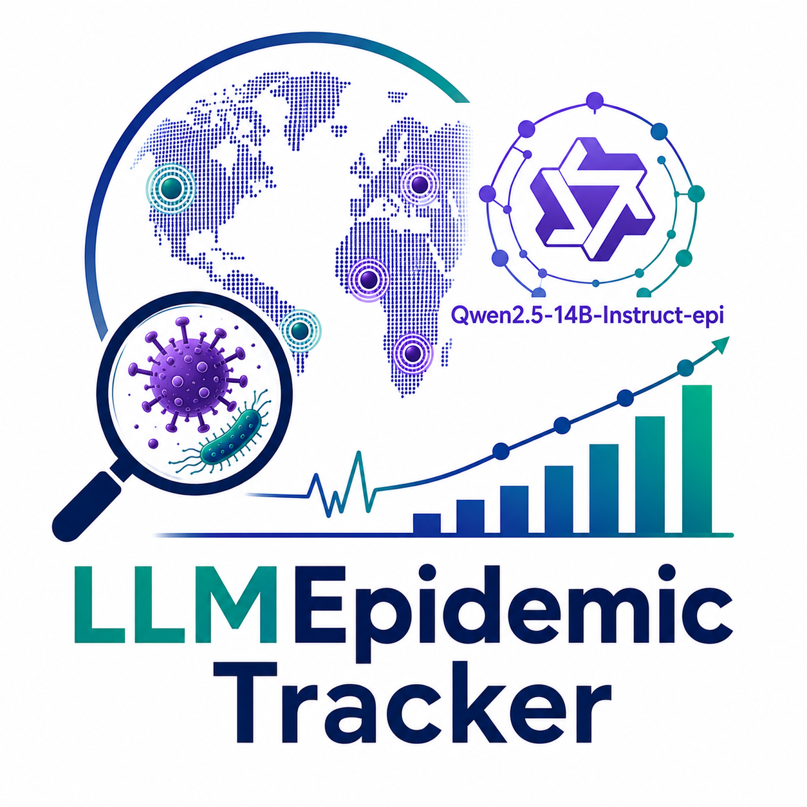

<p align="center">
  
</p>

# LLMEpidemic Tracker

An automated epidemic surveillance system designed to enhance the WHO **Epidemic Intelligence from Open Sources (EIOS)** system using [Qwen2.5-14B-Instruct-epi](https://huggingface.co/anjelinejeline/Qwen2.5-14B-Instruct-epi).

The system retrieves daily news articles from EIOS, extracts structured epidemiological information, prioritizes outbreak alerts, stores the outputs in MongoDB, and presents the results via an interactive Streamlit dashboard.

As a prototype, the system focuses specifically on West Nile virus (WNV) surveillance.

---

## Overview

**LLMEpidemic Tracker** was developed to support epidemic intelligence by significantly reducing the manual burden of reviewing high-volume news feeds. Key features include:

* **Automated data retrieval:** Fetches daily updates directly from the EIOS system.
* **LLM extraction and classification:** Identifies outbreak alerts, species, locations, and transparent reasoning.
* **Interactive visualization:** Offers disease monitoring and risk assessment via a Streamlit application.

---

## System Architecture

The daily production workflow operates according to the following pipeline:

```text
               Daily scheduler (00:00)
                         │
                         ▼
       Retrieve yesterday's articles from EIOS
                         │
                         ▼
             Translation (if required)
                         │
                         ▼
    LLM classification & information extraction
                         │
                         ▼
            Generate structured alerts
                         │
                         ▼
              Store results in MongoDB
                         │
        ┌────────────────┴────────────────┐
        ▼                                 ▼
   classified_records                  wn_alert
  (Individual news)               (Daily aggregated)
                                          │
                                          ▼
                                 Streamlit dashboard
                                          │
                                          ▼
                             Monitoring & risk assessment
```

---

## Repository structure 


The **Joint Research Centre (JRC) of the European Commission** processes the source material for scientific research under the **text and data mining exception (Article 3) of Directive (EU) 2019/790**, where it has lawful access to the content. To comply with this legal framework and the licensing conditions governing the source material, the full datasets are hosted on **Zenodo** with **restricted access** rather than being distributed through this GitHub repository.

- **Restricted access link:** [Click here to access files on Zenodo](https://doi.org/10.5281/zenodo.21839384)

## Repository structure 

```
├── app.py                           # Streamlit application entry point
├── environment.yml                  # Conda environment configuration
├── historical/historical_runner.py  # Historical ingestion script
├── scheduler/runner.py              # Daily scheduler script
├── src/                             # Core system implementation
│   ├── pipeline.py                  # Main processing pipeline orchestrator
│   ├── llm.py                       # LLM inference engine
│   ├── eios_client.py               # EIOS API integration client
│   ├── translator.py                # Translation utilities
│   ├── alert.py                     # Alert object generation 
│   └── dashboard/                   # Modular dashboard UI components
├── results/                         # Runtime outputs, reports, and logs
├── explore/                         # Research notebooks and outputs of the exploration phase 
└── secrets/                         # API keys 
```

---

## How to install it 

1. Recreate the environment from source and activate

```
conda env create --prefix /storage/panelan/conda/ebs -f environment.yml
conda activate /storage/panelan/conda/ebs
```

2. Run the pipeline for historical data 

```
python -m historical/historical_runner.py
```

3.  Run the daily pipeline

```
python historical/historical_runner.py
```

4. Launch the dashboard 
```
streamlit run app.py
```